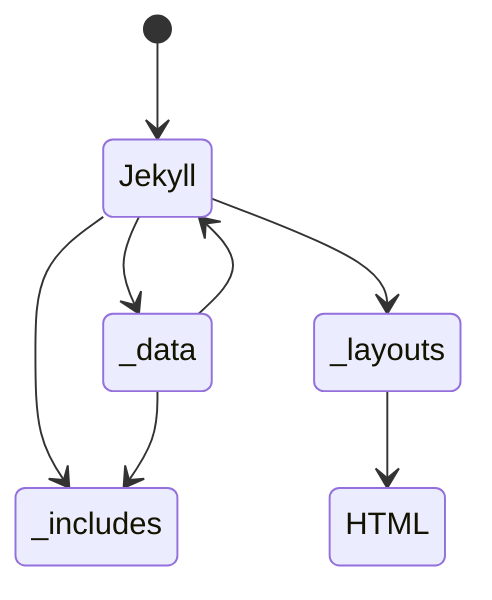

# How it works

* 1: The Jekyll theme will look in the ```_data``` folder and checkout all the .yml files. It will then use the data in these files to generate the pages.

* 2: Make seperate .md or .html files in the root of the project folder. These files will be used to generate the pages. The Jekyll theme will look in the ```_data``` folder and checkout all the .yml files. It will then use the data in these files to generate the pages. Do no forget the ```---``` at the top of the file.

* 3: The Jekyll theme will then generate the page using the template and the data. If the template is ```custom``` then it will use the ```format``` and ```data``` to generate the page. If the template is not ```custom``` then it will use the template to generate the page.

* 4: The Jekyll theme will also have navigation page that will be generated using the ```_data``` folder. The navigation page will be generated using the ```navigation.yml``` file. The navigation page will be generated using the ```navigation.html``` template. The navigation page will be generated using the ```navigation.md``` file.

## State Diagram of the workflow


## Custom Pages

The custom pages are pages that are not generated using the templates in the ```_includes``` folder. They are generated using the ```format``` and ```data``` keys in the .yml file. The ```format``` key is the name of the file in the ```_layouts``` folder. The ```data``` key is a list of key-value pairs. The key is the name of the variable that will be used in the ```format``` file. The value is the value of the variable.

### Table of Main Variables

| Variable Name | Description | Options | Default |
| --- | --- | --- | --- |
| ```width``` | The width of the component on the page. | ```full```, ```half```, ```third```, ```quarter``` | ```full``` |
| ```type``` | The type of component that will be used | ```carrousel```,  ```gallery```, ```post-it```, ```wavy-block```, ```white-bg-block```, ```colored-bg-block```, ```post-it```,```default``` | ```default``` |
| ```background``` | The background color of the component. | ```light```, ```white```, ```blue```, ``` ``` | ``` ``` | 
| ```data``` | All data accociated with with the chosed type of component. | ``` ``` | ``` ``` |

### Component Types

#### Carrousel

The carrousel component is a component that displays a list of child components that can be rotated in and out of view. The carrousel component has the following variables:

| Variable Name | Description | Options | Default |
| --- | --- | --- | --- |
| ```data``` | The data that will be used to generate the child components. | ``` ``` | ``` ``` |
| ```auto-rotate``` | Will decide if the page will automatically rotate between pages | ```True``` , ```False``` | ```False``` |
| ```page-items``` | The number of child components that will be displayed at a time. | 1-5 | ```3``` |
| ```child-component-type``` | The type of child component | ```post-it```, ```wavy-block```, ```white-bg-block```, ```colored-bg-block```, ```post-it``` | ```white-bg-block``` |
